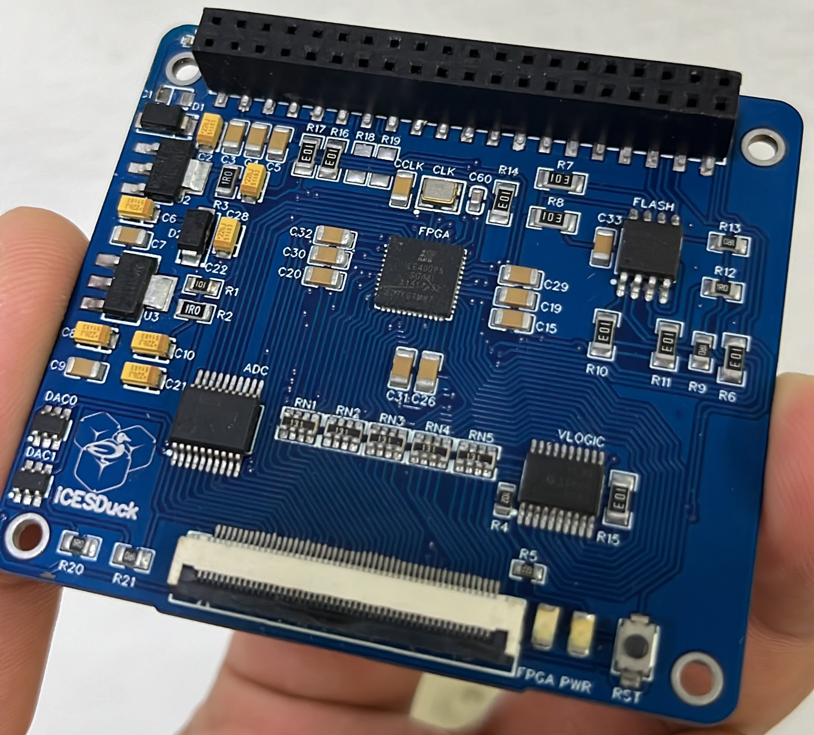
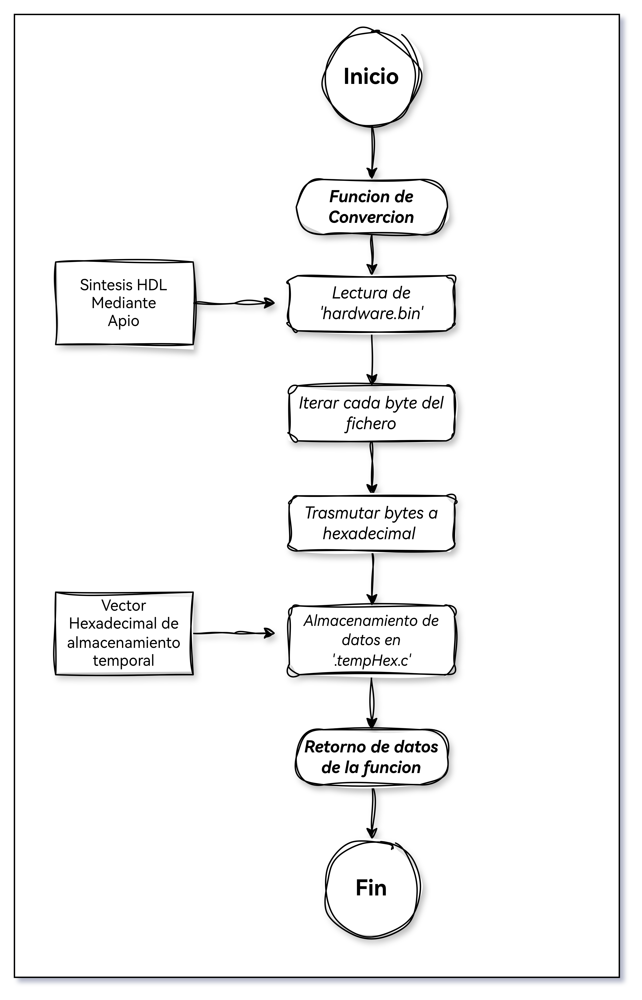

# iCesDuck

<p align="center">
  
</p>

## Introducción

**iCesDuck** es una placa de desarrollo integrada diseñada para facilitar la implementación de diseños digitales complejos mediante la FPGA **Lattice iCE40UP5K**. Permite trasladar proyectos desde simulación HDL hasta hardware real utilizando **Verilog** y **VHDL**, con la **Raspberry Pi 4B** como entorno de síntesis, carga y supervisión.

La placa integra de manera modular una **FPGA programable**, **convertidores analógico-digital (ADC)** y **digital-analógico (DAC)**, así como **adaptadores de nivel lógico** para garantizar compatibilidad de voltajes en el ecosistema de señales mixtas. Esta arquitectura permite experimentación sistematizada sin depender de conexionados improvisados, proporcionando una solución robusta y documentada para prototipado e investigación.

<p align="center">
  
</p>

La comunicación entre la Raspberry Pi e iCesDuck se establece mediante interfaz **SPI**, utilizada para la configuración y carga del bitstream en la FPGA. Adicionalmente, la placa expone canales de comunicación paralela mediante **UART** e **I²C** para intercambio de datos en tiempo real y control de periféricos integrados.

El acceso a señales y entradas/salidas se facilita a través de pines hembra espejo compatibles con el conector GPIO de la Raspberry Pi, complementados por un conector **FFC/FPC (flexible)** dedicado que proporciona acceso directo a drivers y nodos de alta impedancia de la FPGA.

---

### Características principales

| Característica | Especificación |
|---|---|
| **FPGA** | Lattice iCE40UP5K (5.3K LUTs, 128 KB SRAM) |
| **Compatibilidad** | Raspberry Pi 4B (ARM Cortex-A72, GPIO de 3.3 V) |
| **Interfaces de comunicación** | SPI, I²C, UART |
| **Conversión de señales** | ADC/DAC integrados con drivers de nivel lógico |
| **Herramientas de síntesis** | Toolchain de código abierto (APIO + IceStorm) |
| **Lenguajes soportados** | Verilog, VHDL |
| **Expansión** | Conector FFC/FPC para módulos externos |

---

### Aplicaciones

- **Educación**: Laboratorios de sistemas digitales, arquitectura de computadores y electrónica embebida
- **Investigación**: Prototipado de controladores, interfaces y lógica de propósito específico
- **Prototipado industrial**: Validación de diseños antes de síntesis en ASIC o FPGA comercial
- **Depuración de HDL**: Ejecución de pruebas unitarias en hardware real con trazabilidad mediante Raspberry Pi

---

### Origen y visión del proyecto

iCesDuck nace como iniciativa de democratizar el acceso a **herramientas de síntesis HDL de código abierto**, permitiendo a investigadores, estudiantes y profesionales verificar diseños **Verilog** y **VHDL** en hardware real sin depender de soluciones propietarias. 

El proyecto integra la FPGA **iCE40UP5K** con un entorno de cómputo accesible (Raspberry Pi 4B), facilitando la **síntesis**, **configuración** y **supervisión** de lógica digital en una única plataforma compacta. De este modo, iCesDuck cierra la brecha entre simulación y hardware, proporcionando una solución educativa y profesional para laboratorios, centros de investigación y proyectos de ingeniería de controladores embebidos.

Actualmente, el proyecto se encuentra en fase de **maduración técnica**, con secciones de firmware, hardware y documentación que se refinan continuamente. Se fomenta la contribución de la comunidad para **validar, replicar, adaptar y mejorar** todos los componentes, preservando el carácter abierto y colaborativo de la iniciativa.

---

## Estado del proyecto

| Fecha | Versión | Estado | Notas |
|---|---|---|---|
| **05-09-2024** | **0.1-Alpha** | Funcional | Placa ensamblada. FPGA operativa con bitstream verificado. Reguladores (3.3 V/1.2 V) estables. CLK @ 48 MHz validado. Pendiente validación de ADC/DAC. EEPROM requiere persistencia de configuración. |
| **XX-XX-XXXX** | **0.2-Beta** | En desarrollo | Mejora de drivers SPI/I²C, documentación técnica ampliada, ejemplos funcionales. |

---

## Arquitectura del sistema

La plataforma iCesDuck está estructurada en torno a una arquitectura maestro-esclavo, donde la **Raspberry Pi 4B** actúa como unidad de control principal (síntesis, compilación, programación) y **iCesDuck** como módulo especializado para ejecución de lógica digital. Esta separación funcional garantiza máxima flexibilidad:

- **Raspberry Pi 4B**: Procesamiento HDL, gestión de bitstream, supervisión y depuración
- **iCesDuck**: Ejecución de lógica digital, conversión analógica-digital, interfaz de entrada/salida

### Componentes principales

#### Raspberry Pi 4B – Núcleo de procesamiento

La **Raspberry Pi 4B** proporciona capacidad de cómputo ARM para:
- Síntesis de código Verilog/VHDL mediante herramientas de código abierto (APIO, IceStorm)
- Generación del archivo de configuración (bitstream: `hardware.bin`)
- Control de la interfaz SPI para carga del bitstream en la FPGA
- Supervisión de líneas de estado (CDONE, señales de error)
- Depuración y logging en tiempo real

**Conectividad**: Utiliza pines GPIO de 3.3 V del conector J8 para establecer comunicación directa con iCesDuck sin adaptadores externos.

#### FPGA Lattice iCE40UP5K – Motor de lógica programable

La **iCE40UP5K** es el núcleo de iCesDuck, proporcionando:
- **5,280 Look-Up Tables (LUTs)** para implementación de lógica combinacional y secuencial
- **128 KB de SRAM** para memoria de datos y control
- **Multiplicadores embebidos** para operaciones aritméticas eficientes
- **Phase-Locked Loop (PLL)** para síntesis de frecuencias
- Compatibilidad con herramientas de síntesis de código abierto ([APIO](https://github.com/FPGAwars/apio), [IceStorm](http://www.clifford.at/icestorm/))

El bitstream se carga mediante protocolo SPI bit-banging desde la Raspberry Pi, permitiendo reprogramación sin herramientas especializadas.
  
#### Flujo de programación

El proceso de carga del diseño en la FPGA consta de tres etapas:

  #### Inclusión de dependencias

  El programa requiere dos inclusiones fundamentales:

  ```C
  #include ".tempHex.c"      // Vector hexadecimal del bitstream
  #include <bcm2835.h>       // Control de GPIO
  ```

  **`.tempHex.c`**: Archivo generado por `convertir_binario_a_c()` que contiene el vector `bitmap[]` con los datos del bitstream en formato hexadecimal. **`bcm2835.h`**: Librería de bajo nivel que proporciona mapeo de pines GPIO y funciones de acceso directo

  #### Variables de almacenamiento

  En esta sección se definen las rutas de los archivos de entrada y salida para el proceso de conversión:
  
  ```C
  const char *nombre_archivo_entrada = "hardware.bin";
  const char *nombre_archivo_salida  = ".tempHex.c";
  ```
  
  Estas constantes permiten identificar el bitstream generado por APIO y especificar dónde almacenar el archivo intermedio C. Este diseño facilita cambios de rutas sin modificación del código fuente principal.

  #### Conversión del bitstream binario a código C

  Etapa fundamental que transforma el archivo binario del bitstream en un vector C compilable. La función `convertir_binario_a_c()` realiza esta conversión de forma automática:

  <p align="center">
  
  </p>

  ```C
  void convertir_binario_a_c(const char *nombre_archivo_entrada,
                             const char *nombre_archivo_salida);
  ```
  El algoritmo implementa los siguientes pasos:

  1. **Lectura binaria**: Abre `hardware.bin` en modo lectura binaria.
  2. **Iteración**: Recorre cada byte del fichero secuencialmente.
  3. **Conversión hexadecimal**: Transforma cada valor a notación hexadecimal (`0xXX`).
  4. **Generación de vector**: Construye el vector `bitmap[]` completo con todos los bytes.
  5. **Cierre de ficheros**: Finaliza la operación cerrando ambos ficheros.

  El resultado es un fichero C que contiene el bitstream en formato adecuado para inclusión directa en el código fuente, dentro de este archivo se genera la siguiente estructura:
  El resultado es un fichero C que contiene el bitstream como un array de bytes, listo para inclusión directa en el código fuente. Ejemplo del contenido generado:

  ```c
  char bitmap[] = { 0x00, 0xAF, 0x10, ... };
  ```

  El fichero (por ejemplo `.tempHex.c`) se incorpora con `#include ".tempHex.c"` y proporciona `bitmap` y su longitud. El firmware transmite estos bytes por SPI (bit-banging) desde la Raspberry Pi hacia la FPGA usando los pines GPIO definidos; opcionalmente puede almacenarse en la EEPROM para persistencia.

  #### Mapeo de pines GPIO

  La interfaz SPI utiliza seis líneas GPIO del conector J8 de Raspberry Pi:
  
  ```C
  #define SDO     RPI_BPLUS_GPIO_J8_35    // Serial Data Out (MOSI)
  #define SCLK    RPI_BPLUS_GPIO_J8_36    // Serial Clock
  #define CSN     RPI_BPLUS_GPIO_J8_37    // Chip Select Negado
  #define SDI     RPI_BPLUS_GPIO_J8_38    // Serial Data In (MISO)
  #define CRESETB RPI_BPLUS_GPIO_J8_40    // Config Reset (activo bajo)
  #define CDONE   RPI_BPLUS_GPIO_J8_15    // Config Done (entrada)
  ```

  | Nombre | Pin J8 | Dirección | Descripción |
  |---|---|---|---|
  | **SDO** | 35 | Salida | Transmisión de datos → FPGA |
  | **SCLK** | 36 | Salida | Reloj de serialización |
  | **CSN** | 37 | Salida | Chip-Select (0 = activo) |
  | **SDI** | 38 | Entrada | Recepción de datos ← FPGA |
  | **CRESETB** | 40 | Salida | Reset de configuración (0 = reset) |
  | **CDONE** | 15 | Entrada | Indicador de carga completada |
  
  #### Operaciones de línea

  El firmware implementa funciones de manipulación de bajo nivel para cada señal:
  
  ```C
  void assert_sdo();      // Establecer SDO = 1
  void dessert_sdo();     // Establecer SDO = 0
  void assert_sclk();     // Establecer SCLK = 1
  void dessert_sclk();    // Establecer SCLK = 0
  void assert_ss();       // Establecer CSN = 0 (chip seleccionado)
  void dessert_ss();      // Establecer CSN = 1 (chip deseleccionado)
  void sendbyte(char data);  // Transmitir byte completo
  ```

  Estas funciones abstraen el control de GPIO, permitiendo la serialización sincronizada del bitstream.

  #### Compilación y ejecución

  El código fuente se compila enlazando contra la librería **bcm2835**:

  ```bash
  gcc -Wall -O2 iDuck-RP-Upload.c -o iDuck-RP-Upload -lbcm2835
  ```

  Flags utilizados:
  - `-Wall`: Habilita todos los warnings del compilador
  - `-O2`: Optimización de nivel 2 (rendimiento)
  - `-lbcm2835`: Enlace con la librería bcm2835

  La ejecución requiere privilegios de root para acceso directo a memoria GPIO:

  ```bash
  sudo ./iDuck-RP-Upload
  ```

  > **Importante**: El acceso a GPIO requiere ejecución con `sudo`. Se recomienda configurar el usuario dentro del grupo `gpio` para evitar esta requering en futuras ejecuciones.
  
## Funcionamiento

El flujo de trabajo en iCesDuck sigue estos pasos secuenciales:

1. **Síntesis HDL**: El usuario escribe código Verilog/VHDL en su sistema
2. **Compilación**: APIO sintetiza el código y genera `hardware.bin` (bitstream)
3. **Conversión**: El programa C convierte `hardware.bin` a vector hexadecimal (`bitmap[]`)
4. **Carga**: La Raspberry Pi transmite el bitstream a la FPGA mediante SPI bit-banging
5. **Ejecución**: La FPGA ejecuta la lógica programada
6. **Supervisión**: Raspberry Pi monitorea líneas de control y depura en tiempo real

Este ciclo permite iteración rápida entre diseño, validación y depuración sin requerir herramientas costosas o procesos complejos.

---

## Ejemplos y Demostraciones

### Ejemplos incluidos

Se proporcionan ejemplos didácticos que cubren:

- **Contador binario**: Implementación de contadores con diferentes anchos de bit
- **Máquina de estados**: Diseños FSM para control secuencial
- **Interfaz UART**: Comunicación serie con la Raspberry Pi
- **PWM generator**: Generador de PWM variable en frecuencia y duty cycle
- **ADC/DAC**: Ejemplos de conversión analógica-digital en tiempo real

Cada ejemplo incluye:
- Código Verilog comentado
- Testbench para simulación
- Instrucciones de síntesis y carga
- Resultados esperados y validación

### Demostraciones en vivo

Se incluyen scripts Python/Bash para:
- Automatizar síntesis y carga
- Visualizar resultados en tiempo real
- Generar gráficas de señales
- Registrar trazas de depuración

---

## Requisitos y dependencias

### Hardware

- **Raspberry Pi 4B** (4 GB RAM mínimo recomendado)
- **iCesDuck** placa ensamblada y funcional
- **Cable USB** o alimentación dedicada
- **Adaptador de tarjeta SD** para SO

### Software

- **Raspberry Pi OS** (Bullseye o posterior, 64-bit recomendado)
- **APIO** toolchain ([instalación](https://github.com/FPGAwars/apio))
- **Librería bcm2835** (`sudo apt-get install libbcm2835-dev`)
- **Compilador GCC** (incluido por defecto)
- **Herramientas de síntesis**: IceStorm, yosys, nextpnr

### Instalación rápida

```bash
curl -sSL https://raw.githubusercontent.com/iDuck-Electronics/iCesDuck/main/Install/install.sh | bash
```

---

## Solución de problemas

### FPGA no se configura (CDONE permanece en bajo)

**Causas posibles**:
- Bitstream corrupto o mal generado
- Problemas de sincronización SPI
- Conexión deficiente entre pines GPIO

**Soluciones**:
- Verificar permisos de lectura en `hardware.bin`
- Regenerar bitstream con APIO
- Validar continuidad en cables GPIO
- Consultar logs del programa

### Librería bcm2835 no se encuentra

```bash
sudo apt-get install libbcm2835-dev
```

### Acceso denegado a GPIO

```bash
sudo usermod -aG gpio $USER
newgrp gpio
```

Después, reiniciar sesión.

---

## Créditos y contribuciones

### Autor/es

**iCesDuck** fue desarrollado como proyecto de investigación en el contexto de sistemas digitales y electrónica embebida de código abierto.

### Contribuciones

Se alienta la contribución de la comunidad mediante:
- Reportes de bugs y solicitudes de mejora
- Aporte de nuevos ejemplos y tutoriales
- Optimización de código y documentación
- Validación en diferentes versiones de hardware y SO

### Agradecimientos

Agradecemos especialmente a:
- **FPGAwars** por APIO y herramientas de síntesis
- **Clifford Wolf** por el proyecto IceStorm
- Comunidad de código abierto y entusiastas de FPGA

### Licencia

Este proyecto se distribuye bajo licencia abierta. Consultar `LICENSE` para detalles completos.

---

## Recursos adicionales

### Documentación técnica

- [Hoja de datos iCE40UP5K](http://www.latticesemi.com/)
- [GPIO Raspberry Pi](https://www.raspberrypi.org/documentation/computers/gpio/)
- [Verilog HDL Tutorial](https://www.verilogtutor.com/)
- [APIO Documentación](https://github.com/FPGAwars/apio/wiki)

### Comunidades y foros

- [FPGAwars Forum](https://github.com/FPGAwars)
- [Raspberry Pi Forums](https://www.raspberrypi.org/forums/)
- [Stack Overflow FPGA](https://stackoverflow.com/questions/tagged/fpga)

### Proyectos relacionados

- [IceStorm](http://www.clifford.at/icestorm/)
- [Yosys](http://www.clifford.at/yosys/)
- [NextPnR](https://github.com/YosysHQ/nextpnr)

---

**Última actualización**: Febrero 2026  
**Estado**: En desarrollo activo  
**Versión del documento**: 1.0


