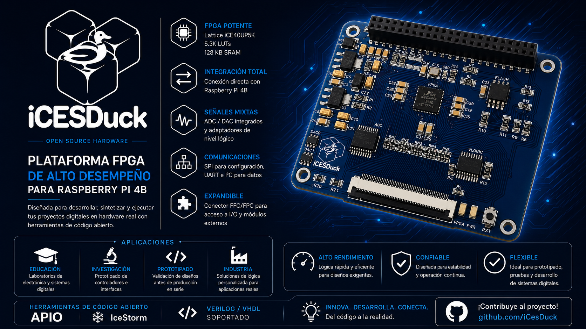

# iCesDuck

  

## Introducción

**iCesDuck** es una placa de desarrollo integrada diseñada para facilitar la implementación de diseños digitales complejos mediante la FPGA **Lattice iCE40UP5K**. Permite trasladar proyectos desde simulación HDL hasta hardware real utilizando **Verilog** y **VHDL**, con la **Raspberry Pi 4B** como entorno de síntesis, carga y supervisión.

La placa integra de manera modular una **FPGA programable**, **convertidores analógico-digital (ADC)** y **digital-analógico (DAC)**, así como **adaptadores de nivel lógico** para garantizar compatibilidad de voltajes en el ecosistema de señales mixtas. Esta arquitectura permite experimentación sistematizada sin depender de conexionados improvisados, proporcionando una solución robusta y documentada para prototipado e investigación.

  

La comunicación entre la Raspberry Pi e iCesDuck se establece mediante interfaz **SPI**, utilizada para la configuración y carga del bitstream en la FPGA. Adicionalmente, la placa expone canales de comunicación paralela mediante **UART** e **I²C** para intercambio de datos en tiempo real y control de periféricos integrados.

El acceso a señales y entradas/salidas se facilita a través de pines hembra espejo compatibles con el conector GPIO de la Raspberry Pi, complementados por un conector **FFC/FPC (flexible)** dedicado que proporciona acceso directo a drivers y nodos de alta impedancia de la FPGA.

---

### Características principales

| Característica | Especificación |
|---|---|
| **FPGA** | Lattice iCE40UP5K (5.3K LUTs, 128 KB SRAM) |
| **Compatibilidad** | Raspberry Pi 4B (ARM Cortex-A72, GPIO de 3.3 V) |
| **Interfaces de comunicación** | SPI, I²C, UART |
| **Conversión de señales** | ADC/DAC integrados con drivers de nivel lógico |
| **Herramientas de síntesis** | Toolchain de código abierto (APIO + IceStorm) |
| **Lenguajes soportados** | Verilog, VHDL |
| **Expansión** | Conector FFC/FPC para módulos externos |

---

### Aplicaciones

- **Educación**: Laboratorios de sistemas digitales, arquitectura de computadores y electrónica embebida
- **Investigación**: Prototipado de controladores, interfaces y lógica de propósito específico
- **Prototipado industrial**: Validación de diseños antes de síntesis en ASIC o FPGA comercial
- **Depuración de HDL**: Ejecución de pruebas unitarias en hardware real con trazabilidad mediante Raspberry Pi

---

### Origen y visión del proyecto

iCesDuck nace como iniciativa de democratizar el acceso a **herramientas de síntesis HDL de código abierto**, permitiendo a investigadores, estudiantes y profesionales verificar diseños **Verilog** y **VHDL** en hardware real sin depender de soluciones propietarias. 

El proyecto integra la FPGA **iCE40UP5K** con un entorno de cómputo accesible (Raspberry Pi 4B), facilitando la **síntesis**, **configuración** y **supervisión** de lógica digital en una única plataforma compacta. De este modo, iCesDuck cierra la brecha entre simulación y hardware, proporcionando una solución educativa y profesional para laboratorios, centros de investigación y proyectos de ingeniería de controladores embebidos.

Actualmente, el proyecto se encuentra en fase de **maduración técnica**, con secciones de firmware, hardware y documentación que se refinan continuamente. Se fomenta la contribución de la comunidad para **validar, replicar, adaptar y mejorar** todos los componentes, preservando el carácter abierto y colaborativo de la iniciativa.

---

## Estado del proyecto

| Fecha | Versión | Estado | Notas |
|---|---|---|---|
| **05-03-2025** | **V1.A1** | Funcional | Placa ensamblada. FPGA operativa con bitstream verificado. Reguladores (3.3 V/1.2 V) estables. CLK @ 48 MHz validado. Pendiente validación de ADC/DAC. EEPROM requiere persistencia de configuración. |

| **17-09-2025** | **V1.A1** | Fallo detectado | Lineas de Comunicacion entre la EEPROM, y GPIO-Raspberry Pi 4B cruzdas de forma herronea. FPGA si se programa de forma directa, no mantiene el codigo despues de un reinicio.  |

| **03-08-2026** | **V1.A2** | En desarrollo | Mejora en Lineas de Comunicacion, drivers SPI/I²C/UART, documentación técnica ampliada, ejemplos funcionales. |

---

## Arquitectura del sistema

La plataforma iCesDuck está estructurada en torno a una arquitectura maestro-esclavo, donde la **Raspberry Pi 4B** actúa como unidad de control principal (síntesis, compilación, programación) y **iCesDuck** como módulo especializado para ejecución de lógica digital. Esta separación funcional garantiza máxima flexibilidad:

- **Raspberry Pi 4B**: Procesamiento HDL, gestión de bitstream, supervisión y depuración
- **iCesDuck**: Ejecución de lógica digital, conversión analógica-digital, interfaz de entrada/salida

### Componentes principales

#### Raspberry Pi 4B – Núcleo de procesamiento

La **Raspberry Pi 4B** proporciona capacidad de cómputo ARM para:
- Síntesis de código Verilog/VHDL mediante herramientas de código abierto (APIO, IceStorm)
- Generación del archivo de configuración (bitstream: `hardware.bin`)
- Control de la interfaz SPI para carga del bitstream en la FPGA
- Supervisión de líneas de estado (CDONE, señales de error)
- Depuración y logging en tiempo real

**Conectividad**: Utiliza pines GPIO de 3.3 V del conector J8 para establecer comunicación directa con iCesDuck sin adaptadores externos.

#### FPGA Lattice iCE40UP5K – Motor de lógica programable

La **iCE40UP5K** es el núcleo de iCesDuck, proporcionando:
- **5,280 Look-Up Tables (LUTs)** para implementación de lógica combinacional y secuencial
- **128 KB de SRAM** para memoria de datos y control
- **Multiplicadores embebidos** para operaciones aritméticas eficientes
- **Phase-Locked Loop (PLL)** para síntesis de frecuencias
- Compatibilidad con herramientas de síntesis de código abierto ([APIO](https://github.com/FPGAwars/apio), [IceStorm](http://www.clifford.at/icestorm/))

El bitstream se carga mediante protocolo SPI bit-banging desde la Raspberry Pi, permitiendo reprogramación sin herramientas especializadas.
  
## Funcionamiento

El flujo de trabajo en iCesDuck sigue estos pasos secuenciales:

1. **Síntesis HDL**: El usuario escribe código Verilog/VHDL en su sistema
2. **Compilación**: APIO sintetiza el código y genera `hardware.bin` (bitstream)
3. **Conversión**: El programa C convierte `hardware.bin` a vector hexadecimal (`bitmap[]`)
4. **Carga**: La Raspberry Pi transmite el bitstream a la FPGA mediante SPI bit-banging
5. **Ejecución**: La FPGA ejecuta la lógica programada
6. **Supervisión**: Raspberry Pi monitorea líneas de control y depura en tiempo real

Este ciclo permite iteración rápida entre diseño, validación y depuración sin requerir herramientas costosas o procesos complejos.

---

---

## Créditos y contribuciones

### Autor/es

**iCesDuck** fue desarrollado como proyecto de investigación en el contexto de sistemas digitales y electrónica embebida de código abierto.

### Contribuciones

Se alienta la contribución de la comunidad mediante:
- Reportes de bugs y solicitudes de mejora
- Aporte de nuevos ejemplos y tutoriales
- Optimización de código y documentación
- Validación en diferentes versiones de hardware y SO

### Agradecimientos

Agradecemos especialmente a:
- **FPGAwars** por APIO y herramientas de síntesis
- **Clifford Wolf** por el proyecto IceStorm
- Comunidad de código abierto y entusiastas de FPGA

### Licencia

Este proyecto se distribuye bajo licencia abierta. Consultar `LICENSE` para detalles completos.

---

## Recursos adicionales

### Documentación técnica

- [Hoja de datos iCE40UP5K](http://www.latticesemi.com/)
- [GPIO Raspberry Pi](https://www.raspberrypi.org/documentation/computers/gpio/)
- [Verilog HDL Tutorial](https://www.verilogtutor.com/)
- [APIO Documentación](https://github.com/FPGAwars/apio/wiki)

### Comunidades y foros

- [FPGAwars Forum](https://github.com/FPGAwars)
- [Raspberry Pi Forums](https://www.raspberrypi.org/forums/)
- [Stack Overflow FPGA](https://stackoverflow.com/questions/tagged/fpga)

### Proyectos relacionados

- [IceStorm](http://www.clifford.at/icestorm/)
- [Yosys](http://www.clifford.at/yosys/)
- [NextPnR](https://github.com/YosysHQ/nextpnr)

---

**Última actualización**: Febrero 2026  
**Estado**: En desarrollo activo  
**Versión del documento**: 1.0

