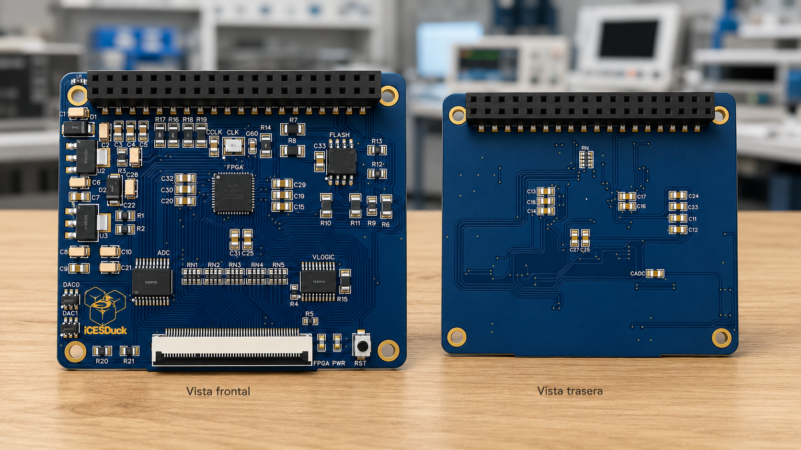
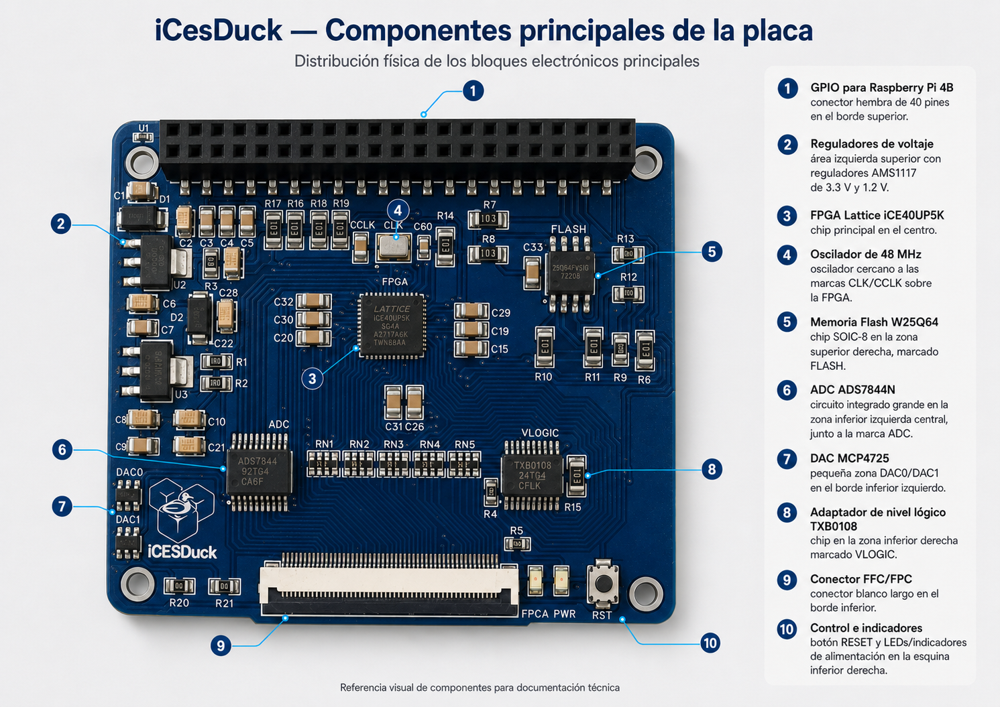
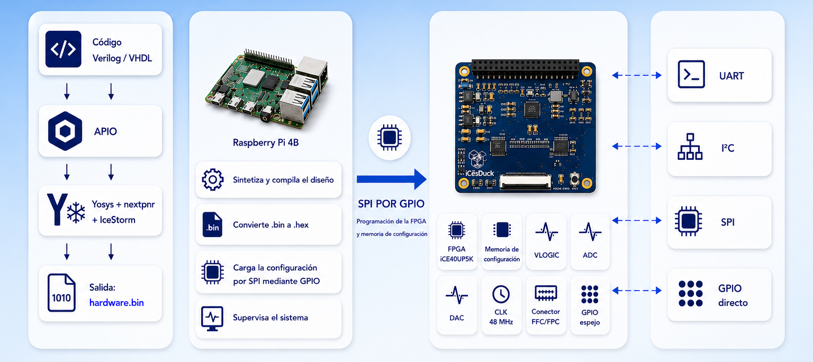
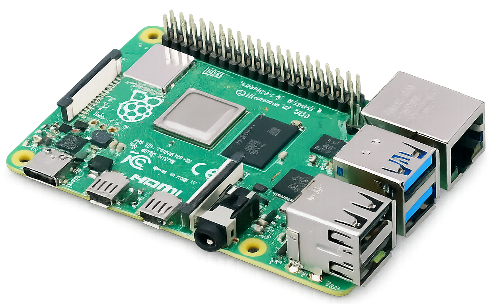
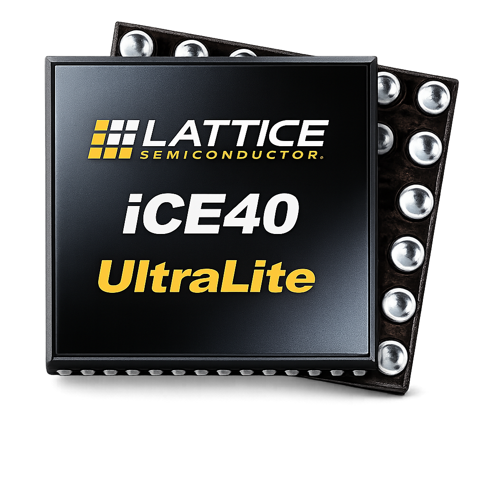
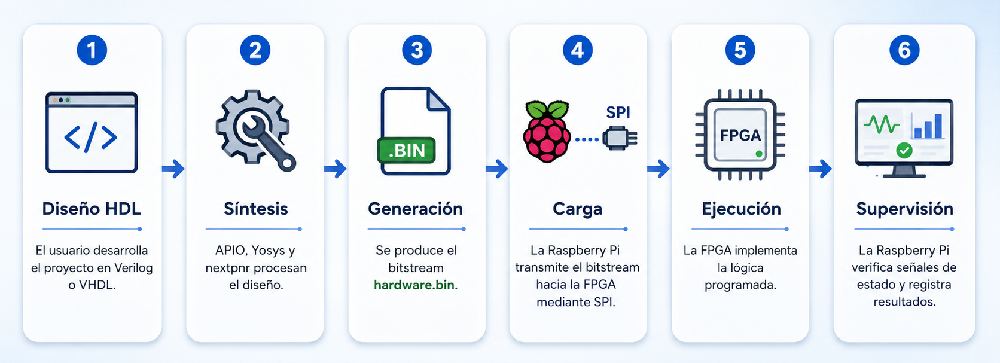
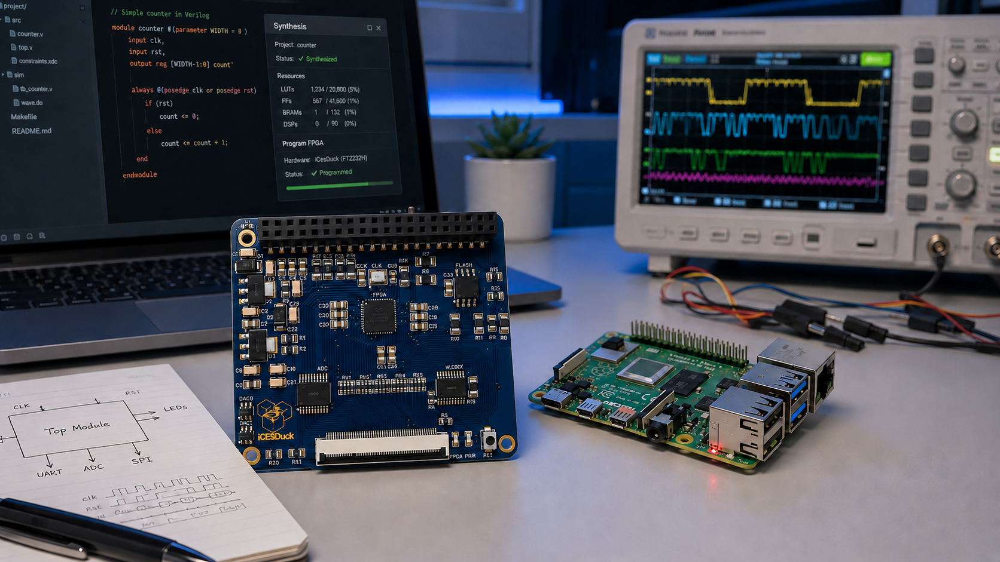

# iCesDuck

  

  
  
  
  

  <strong>Plataforma FPGA de código abierto para Raspberry Pi 4B</strong> 
  Síntesis, programación y supervisión de lógica digital en una arquitectura compacta, modular y orientada a la experimentación.

---

## Descripción general

**iCesDuck** es una placa de desarrollo basada en la FPGA **Lattice iCE40UP5K**, diseñada para trasladar proyectos escritos en **Verilog** y **VHDL** desde la simulación HDL hasta su ejecución en hardware real.

La **Raspberry Pi 4B** funciona como sistema anfitrión y entorno principal de trabajo: realiza la síntesis, genera el bitstream, programa la FPGA y supervisa el comportamiento de la plataforma. Esta integración permite desarrollar, probar y depurar diseños digitales sin depender de herramientas propietarias o programadores externos especializados.

La placa incorpora recursos para trabajar con señales digitales y mixtas, entre ellos:

- FPGA programable **Lattice iCE40UP5K**.
- Convertidores **ADC** y **DAC**.
- Adaptadores de nivel lógico.
- Memoria de configuración.
- Reloj de **48 MHz**.
- Comunicación mediante **SPI**, **I²C** y **UART**.
- Conector **FFC/FPC** para expansión y acceso a señales externas.
- Conector GPIO espejo compatible con Raspberry Pi 4B.

  

> **Objetivo del proyecto:** ofrecer una plataforma abierta y documentada para aprender, investigar y prototipar sistemas digitales con FPGA, utilizando la Raspberry Pi como unidad de desarrollo, programación y supervisión.

  
  &nbsp;
  
  &nbsp;
  

  
  &nbsp;
  

---

## Características principales

<table>
  <thead>
    <tr>
      <th width="20%" align="left">Característica</th>
      <th width="24%" align="left">Especificación</th>
      <th width="48%" align="center">Distribución de componentes</th>
    </tr>
  </thead>
  <tbody>
    <tr>
      <td><strong>FPGA</strong></td>
      <td>Lattice iCE40UP5K</td>
      <td rowspan="11" align="center" valign="middle">
        
         
        <em>Distribución general de los principales bloques electrónicos de la placa.</em>
      </td>
    </tr>
    <tr><td><strong>Capacidad lógica</strong></td><td>5,280 LUTs</td></tr>
    <tr><td><strong>Memoria interna</strong></td><td>128 KB de SRAM</td></tr>
    <tr><td><strong>Compatibilidad</strong></td><td>Raspberry Pi 4B</td></tr>
    <tr><td><strong>Nivel lógico principal</strong></td><td>3.3 V</td></tr>
    <tr><td><strong>Interfaces</strong></td><td>SPI, I²C y UART</td></tr>
    <tr><td><strong>Conversión de señales</strong></td><td>ADC y DAC integrados</td></tr>
    <tr><td><strong>Reloj</strong></td><td>48 MHz</td></tr>
    <tr><td><strong>Lenguajes HDL</strong></td><td>Verilog y VHDL</td></tr>
    <tr><td><strong>Toolchain</strong></td><td>APIO, Yosys, nextpnr e IceStorm</td></tr>
    <tr><td><strong>Expansión</strong></td><td>GPIO espejo y conector FFC/FPC</td></tr>
  </tbody>
</table>

---

## Aplicaciones

- **Educación:** laboratorios de sistemas digitales, FPGA, arquitectura de computadores y electrónica embebida.
- **Investigación:** validación de controladores, interfaces digitales y lógica de propósito específico.
- **Prototipado:** pruebas funcionales antes de migrar un diseño a otra FPGA o a una solución dedicada.
- **Depuración HDL:** ejecución de testbench, comparación de resultados y validación en hardware real.
- **Señales mixtas:** adquisición, procesamiento y generación de señales mediante ADC, DAC y adaptadores de nivel.

---

## Revisiones de hardware

El desarrollo de iCesDuck se mantiene en evolución continua. Conforme se identifiquen errores, se validen nuevos bloques, se incorporen mejoras o se generen nuevas revisiones de hardware, los cambios correspondientes serán documentados y publicados en este repositorio para mantener la trazabilidad técnica del proyecto.

| Revisión | Estado | Ubicación |
|---|---|---|
| **V1.A1** | Primera revisión funcional con errores identificados | [`iCesDuck V1.A1`](hardware/boards-iCesDuck/v1-a1/) |
| **V1.A2** | Segunda revisión en desarrollo | [`iCesDuck V1.A1`](hardware/boards-iCesDuck/v1-a2/) |

---

## Explora iCesDuck

El repositorio está organizado por áreas especializadas. Cada una representa una etapa concreta del desarrollo, desde el diseño electrónico de la placa hasta la creación, programación y validación de proyectos HDL.

> **Ruta recomendada:** comienza con la documentación, ejecuta un ejemplo HDL y después entra al software, al hardware o a las pruebas según el área que quieras desarrollar.

  <strong>🔷 Hardware iCesDuck</strong>
  <code>PCB</code>
  <code>EasyEDA</code>
  <code>fabricación</code>

 

  
   
  <em>Diseño electrónico, revisiones físicas y recursos para reproducir la plataforma.</em>

 

  
  
  

Documenta la evolución física de la plataforma: esquemáticos, PCB, revisiones, modelos 3D, archivos de fabricación y evidencias de validación.

**Úsala para:** estudiar la placa, comparar versiones, recuperar las fuentes originales o preparar el hardware para fabricación.

  

  <strong>⚙️ iDuck-Upload</strong>
  <code>Raspberry Pi</code>
  <code>SPI</code>
  <code>programación</code>

 

  
   
  <em>Preparación, conversión y carga de la configuración mediante Raspberry Pi.</em>

 

  
  
  

Reúne las herramientas utilizadas para preparar, convertir y transmitir la configuración hacia la FPGA y su memoria mediante SPI sobre GPIO.

**Úsala para:** instalar el cargador, configurar pines, convertir archivos y programar iCesDuck desde Raspberry Pi.

  

  <strong>🧩 Diseños HDL</strong>
  <code>Verilog</code>
  <code>VHDL</code>
  <code>bitstreams</code>

 

  
   
  <em>Diseño, simulación, síntesis y generación de configuraciones para la FPGA.</em>

 

  
  
  

Concentra el código de hardware, las restricciones de pines, los bancos de prueba y los bitstreams producidos para la FPGA Lattice iCE40UP5K.

**Úsala para:** desarrollar lógica digital, simular diseños, definir pines o preparar un proyecto para síntesis.

  

  <strong>💡 Ejemplos</strong>
  <code>aprendizaje</code>
  <code>demostraciones</code>
  <code>prácticas</code>

 

  
   
  <em>Proyectos progresivos para conocer y validar las funciones de iCesDuck.</em>

 

  
  
  

Presenta proyectos progresivos para conocer la plataforma, comprobar sus interfaces y reutilizar diseños funcionales como base para nuevos desarrollos.

**Úsala para:** ejecutar una primera prueba, aprender el flujo de trabajo o validar bloques específicos de la placa.

  

  <strong>🧪 Pruebas y validación</strong>
  <code>hardware</code>
  <code>software</code>
  <code>HDL</code>

 

  
   
  <em>Procedimientos y evidencias para comprobar el funcionamiento del sistema.</em>

 

  
  
  

Documenta procedimientos, mediciones, incidencias, resultados y evidencias para comprobar el funcionamiento independiente e integrado del sistema.

**Úsala para:** reproducir pruebas, revisar resultados, registrar fallos o validar nuevas revisiones.

  

  <strong>📘 Documentación</strong>
  <code>inicio</code>
  <code>arquitectura</code>
  <code>protocolos</code>

 

  
   
  <em>Guías, arquitectura y referencias técnicas para comprender y ampliar la plataforma.</em>

 

  
  
  

Explica cómo instalar, comprender, utilizar, mantener y ampliar iCesDuck mediante guías, referencias técnicas y documentación de arquitectura.

**Úsala para:** preparar el entorno, consultar interfaces, entender el sistema o documentar nuevas funciones.

  

---

## Estado del proyecto

| Fecha | Versión | Estado | Notas |
|---|---|---|---|
| **05-03-2025** | **V1.A1** | Funcional | Placa ensamblada, FPGA programada correctamente, reguladores de 3.3 V y 1.2 V estables y reloj de 48 MHz validado. ADC y DAC pendientes de validación completa. |
| **17-09-2025** | **V1.A1** | Fallo identificado | Se detectó un cruce incorrecto en líneas de comunicación relacionadas con la memoria de configuración y los GPIO de la Raspberry Pi 4B. La FPGA puede programarse directamente, pero no conserva la configuración después de un reinicio. |
| **Planificada: 03-08-2026** | **V2.A1** | En desarrollo | Corrección de líneas de comunicación, revisión de SPI, I²C y UART, ampliación de documentación y preparación de nuevos ejemplos funcionales. |

---

## Arquitectura del sistema

iCesDuck utiliza una arquitectura **host–dispositivo**, en la que la **Raspberry Pi 4B** funciona como unidad de desarrollo, programación y supervisión, mientras que la placa **iCesDuck** actúa como plataforma de ejecución para la lógica digital.

El flujo comienza en la Raspberry Pi, donde el usuario desarrolla el diseño en **Verilog o VHDL**. Mediante **APIO**, **Yosys**, **nextpnr** e **IceStorm**, el código HDL se sintetiza y se convierte en un archivo binario de configuración. Posteriormente, una herramienta de carga transforma el archivo generado al formato requerido y lo transmite por **SPI**, utilizando los GPIO de la Raspberry Pi, hacia la FPGA y la memoria de configuración de iCesDuck.

Una vez programada, la plataforma ejecuta el diseño directamente en hardware y permite utilizar sus recursos integrados:

- FPGA **Lattice iCE40UP5K**.
- Memoria de configuración.
- Convertidores **ADC** y **DAC**.
- Adaptador de nivel lógico **VLOGIC**.
- Reloj de **48 MHz**.
- Conector de expansión **FFC/FPC**.
- GPIO de comunicación y control.

  

  <em>Flujo general desde el diseño HDL en la Raspberry Pi 4B hasta la ejecución y comunicación con la plataforma iCesDuck.</em>

### Función de cada elemento

- **Raspberry Pi 4B:** proporciona el entorno de desarrollo, sintetiza el diseño HDL, genera los archivos de configuración, controla la programación mediante GPIO y supervisa el funcionamiento del sistema.
- **Interfaz SPI:** constituye el enlace principal para transferir la configuración hacia la FPGA y la memoria no volátil.
- **Plataforma iCesDuck:** almacena y ejecuta la lógica programada, además de proporcionar acceso a los periféricos, señales y conectores de expansión.
- **Interfaces de operación:** una vez cargado el diseño, la comunicación entre la Raspberry Pi, la FPGA y otros dispositivos puede realizarse mediante **UART**, **I²C**, **SPI** y GPIO directo.

Esta organización separa el proceso de desarrollo del proceso de ejecución: la Raspberry Pi administra la síntesis y la programación, mientras que iCesDuck implementa el diseño digital en hardware y mantiene disponibles sus recursos de adquisición, generación y adaptación de señales.

### Componentes principales

La arquitectura distribuye sus funciones entre el sistema anfitrión y el dispositivo programable:

<table>
<tr>
<td width="50%" valign="top">

  

<h4 align="center">Raspberry Pi 4B</h4>

<strong>Host de desarrollo, programación y supervisión</strong>

<ul>
<li>Proporciona el entorno de desarrollo y compilación.</li>
<li>Procesa diseños escritos en <strong>Verilog</strong> y <strong>VHDL</strong>.</li>
<li>Ejecuta la síntesis mediante APIO, Yosys, nextpnr e IceStorm.</li>
<li>Genera el archivo <code>hardware.bin</code>.</li>
<li>Convierte la configuración al formato requerido para la carga.</li>
<li>Programa la FPGA y la memoria mediante SPI sobre GPIO.</li>
<li>Supervisa señales de estado como <code>CDONE</code>.</li>
<li>Permite controlar y depurar el sistema en tiempo real.</li>
</ul>

<kbd>Desarrollo</kbd>
<kbd>Síntesis</kbd>
<kbd>Programación</kbd>
<kbd>Supervisión</kbd>

</td>
<td width="50%" valign="top">

  

<h4 align="center">FPGA Lattice iCE40UP5K</h4>

<strong>Unidad de ejecución de lógica digital</strong>

<ul>
<li>Implementa el diseño sintetizado directamente en hardware.</li>
<li>Integra <strong>5,280 LUTs</strong> para lógica combinacional y secuencial.</li>
<li>Dispone de <strong>128 KB de SRAM</strong> interna.</li>
<li>Incluye multiplicadores embebidos para procesamiento digital.</li>
<li>Incorpora PLL para generación y ajuste de frecuencias.</li>
<li>Controla los periféricos y señales internas de la plataforma.</li>
<li>Interactúa con ADC, DAC, VLOGIC, reloj y expansión FFC/FPC.</li>
<li>Es compatible con herramientas de síntesis de código abierto.</li>
</ul>

<kbd>Ejecución</kbd>
<kbd>Lógica digital</kbd>
<kbd>Periféricos</kbd>
<kbd>Expansión</kbd>

</td>
</tr>
</table>

> La Raspberry Pi prepara, programa y supervisa el sistema; la FPGA convierte el diseño sintetizado en lógica digital ejecutándose directamente sobre hardware.

---

## Flujo de trabajo

El proceso de desarrollo de iCesDuck se organiza en seis etapas: diseño HDL, síntesis, generación del bitstream, carga, ejecución y supervisión.

  

  <em>Flujo general desde el desarrollo del código HDL hasta la ejecución y validación del diseño sobre hardware real.</em>

### Etapas del proceso

1. **Diseño HDL:** el usuario desarrolla el proyecto en Verilog o VHDL.
2. **Síntesis:** APIO, Yosys y nextpnr procesan el diseño.
3. **Generación:** se produce el bitstream `hardware.bin`.
4. **Carga:** la Raspberry Pi transmite el bitstream hacia la FPGA mediante SPI.
5. **Ejecución:** la FPGA implementa la lógica programada.
6. **Supervisión:** la Raspberry Pi verifica señales de estado y registra resultados.

> Este flujo facilita ciclos rápidos de diseño, prueba, corrección y validación sobre hardware real.

---

## Visión del proyecto

iCesDuck nace con el propósito de acercar el desarrollo con FPGA a estudiantes, investigadores y profesionales mediante una plataforma abierta, accesible y reproducible.

El proyecto busca reducir la separación entre la simulación HDL y la implementación física, integrando en una sola plataforma la síntesis, la programación, la supervisión y el acceso a señales digitales y mixtas.

  

  <em>iCesDuck integra el desarrollo HDL, la programación de la FPGA y la validación de señales sobre hardware real.</em>

Actualmente, iCesDuck se encuentra en una etapa de **maduración técnica**. Las revisiones de hardware, el software de carga, los ejemplos y la documentación continúan evolucionando conforme se validan nuevos bloques y se corrigen los problemas identificados en versiones anteriores.

---

## Contribuciones

Las contribuciones pueden incluir:

- Reportes de errores.
- Validación de nuevas revisiones de hardware.
- Mejoras en el cargador de la FPGA.
- Ejemplos Verilog o VHDL.
- Testbench y pruebas automatizadas.
- Correcciones y ampliaciones de documentación.

Antes de realizar cambios importantes, revisa la estructura del repositorio y procura mantener separadas las áreas de hardware, software, HDL, pruebas y documentación.

---

## Agradecimientos

- **FPGAwars**, por APIO y su ecosistema de herramientas.
- **Clifford Wolf**, por IceStorm y Yosys.
- **YosysHQ**, por nextpnr y herramientas relacionadas.
- Comunidad de hardware y software de código abierto.

---

## Recursos externos

- [Lattice Semiconductor](https://www.latticesemi.com/)
- [APIO](https://github.com/FPGAwars/apio)
- [Project IceStorm](https://github.com/YosysHQ/icestorm)
- [Yosys](https://github.com/YosysHQ/yosys)
- [nextpnr](https://github.com/YosysHQ/nextpnr)
- [Documentación de GPIO de Raspberry Pi](https://www.raspberrypi.com/documentation/computers/raspberry-pi.html)

---

## Licencia

Este proyecto se distribuye bajo una licencia abierta. Consulta el archivo [`LICENSE`](LICENSE) para conocer sus términos y condiciones.

---

  <strong>iCesDuck</strong> 
  FPGA · Raspberry Pi · Verilog · VHDL · Open Source

