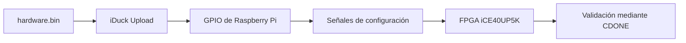
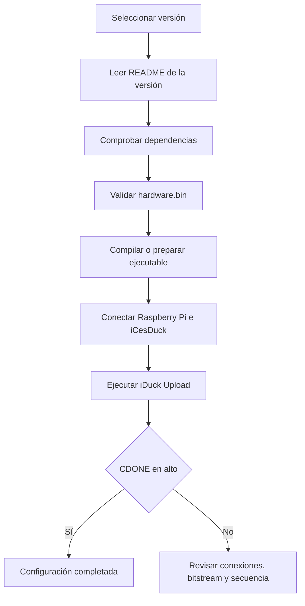

<div align="center">

# Software · iCesDuck

### Herramientas de carga, control y soporte para la plataforma iCesDuck

**Raspberry Pi · GPIO · FPGA iCE40UP5K · Linux ARM64**

</div>

---

<!--
IMAGEN PENDIENTE
Ruta sugerida: utilities/assets/software-banner.png
Descripción: Banner general del área de software de iCesDuck.
-->

<p align="center">
  
</p>

> [!NOTE]
> Este directorio concentra las herramientas de software que permiten preparar, cargar, documentar y mantener los componentes programables de iCesDuck.

## Navegación rápida

- [Descripción general](#descripción-general)
- [Estructura del directorio](#estructura-del-directorio)
- [iDuck Upload](#iduck-upload)
- [Versiones disponibles](#versiones-disponibles)
- [Utilities](#utilities)
- [Flujo de trabajo](#flujo-de-trabajo)
- [Uso general](#uso-general)
- [Documentación e imágenes](#documentación-e-imágenes)
- [Buenas prácticas](#buenas-prácticas)

---

## Descripción general

El apartado `software/` reúne los programas y recursos utilizados por la Raspberry Pi para interactuar con el hardware de iCesDuck.

Su función principal es mantener separadas y organizadas:

- las herramientas ejecutables;
- las diferentes revisiones del cargador;
- la documentación de arquitectura;
- los diagramas e imágenes del proyecto;
- los recursos auxiliares necesarios para instalación, validación y mantenimiento.

Esta organización evita concentrar todo el proyecto en un único archivo y permite que cada versión conserve su propio código, ejecutable, documentación y archivos compatibles.

---

## Estructura del directorio

```text
software/
├── uploader/
│   ├── iDuck_Upload-v1.A0/
│   └── iDuck_Upload-v1.A1/
├── utilities/
│   ├── architecture/
│   └── assets/
└── README.md
```

| Ruta | Propósito |
|---|---|
| `uploader/` | Almacena las versiones del software encargado de cargar la configuración en la FPGA. |
| `uploader/iDuck_Upload-v1.A0/` | Conserva una revisión independiente del cargador iDuck Upload. |
| `uploader/iDuck_Upload-v1.A1/` | Conserva otra revisión del cargador sin reemplazar la versión anterior. |
| `utilities/architecture/` | Contiene diagramas, flujos, mapas de conexión y documentación de arquitectura. |
| `utilities/assets/` | Contiene banners, capturas, fotografías, iconos y demás recursos visuales. |
| `README.md` | Presenta una vista general del área de software y orienta al usuario dentro del directorio. |

> [!IMPORTANT]
> Cada versión del cargador debe conservar su propio `README.md`, bitstream, código fuente, ejecutable y notas de cambios. No se recomienda mezclar archivos entre versiones sin comprobar su compatibilidad.

---

## iDuck Upload

**iDuck Upload** es la utilidad encargada de transferir el archivo de configuración de la FPGA desde una Raspberry Pi hacia la tarjeta iCesDuck.

La implementación revisada está desarrollada en C y utiliza la biblioteca `bcm2835` para controlar directamente los GPIO de la Raspberry Pi. La transmisión se realiza mediante una interfaz serial implementada por software, conocida como **bit-banging**.

### Funcionamiento general



Durante una carga normal, el programa realiza las siguientes acciones:

1. Inicializa el acceso a los GPIO.
2. Coloca la FPGA en modo de configuración.
3. Controla las señales de reinicio, selección, reloj y datos.
4. Transmite el bitstream byte por byte y bit por bit.
5. Supervisa la señal `CDONE` para determinar si la configuración terminó correctamente.

<details>
<summary><strong>Señales principales utilizadas</strong></summary>

| Señal | Función general |
|---|---|
| `SDO` | Envía los datos desde la Raspberry Pi hacia la FPGA. |
| `SCLK` | Genera el reloj de configuración. |
| `CSN` | Selecciona la FPGA durante la transferencia. |
| `CRESET_B` | Reinicia la lógica de configuración de la FPGA. |
| `CDONE` | Confirma si la configuración fue aceptada. |
| `SDI` | Entrada reservada para comunicación o funciones futuras. |

</details>

### Alcance del cargador

El cargador permite que la Raspberry Pi funcione como controlador de configuración de iCesDuck, reduciendo la dependencia de un programador externo durante el arranque o durante pruebas de desarrollo.

La versión actual debe manejarse como una implementación en evolución. Antes de liberar una revisión estable deben validarse la secuencia de configuración, los tiempos, los relojes finales y el comportamiento de `CDONE`.

---

<!--
IMAGEN PENDIENTE
Ruta sugerida: utilities/assets/uploader-flow.png
Descripción: Raspberry Pi conectada a iCesDuck mostrando SDO, SCLK, CSN, CRESET_B y CDONE.
-->

<p align="center">
  
</p>

---

## Versiones disponibles

Las diferentes versiones del cargador se encuentran dentro de:

```text
software/uploader/
```

Actualmente, la estructura contempla:

```text
iDuck_Upload-v1.A0/
iDuck_Upload-v1.A1/
```

Cada carpeta representa una revisión independiente. Esto permite:

- conservar versiones anteriores funcionales;
- comparar cambios entre revisiones;
- evitar que una actualización sobrescriba una entrega estable;
- mantener bitstreams compatibles con una revisión específica;
- documentar errores, mejoras y pruebas de manera separada.

### Convención sugerida de versionado

```text
v1.A0
│ │ └── número de revisión
│ └──── etapa o serie de desarrollo
└────── versión principal
```

> [!TIP]
> Antes de ejecutar una versión, revise siempre el `README.md` ubicado dentro de su carpeta. Ese archivo debe indicar requisitos, dependencias, compatibilidad, método de instalación y estado de validación.

### Cómo localizar una versión

```bash
cd software/uploader
ls
```

Después, ingrese a la revisión que desea utilizar:

```bash
cd iDuck_Upload-v1.A0
```

Para cambiar de revisión, regrese a `uploader/` y seleccione otra carpeta. No copie únicamente el ejecutable: mantenga juntos los archivos pertenecientes a la misma versión.

---

## Utilities

El directorio `utilities/` reúne los recursos compartidos por las diferentes versiones del software.

### `utilities/architecture/`

Este apartado debe utilizarse para almacenar:

- diagramas de bloques;
- diagramas de secuencia;
- arquitectura de software;
- mapas de conexión GPIO;
- flujos de instalación;
- procesos de compilación;
- relación entre Raspberry Pi, iCesDuck y FPGA;
- documentación técnica complementaria.

Ejemplo de organización:

```text
utilities/architecture/
├── software-overview.md
├── uploader-sequence.md
├── gpio-map.md
└── diagrams/
```

### `utilities/assets/`

Este apartado concentra los recursos visuales usados por los archivos Markdown:

```text
utilities/assets/
├── software-banner.png
├── software-architecture.png
├── uploader-flow.png
├── version-comparison.png
└── screenshots/
```

Se recomienda utilizar nombres descriptivos, evitar espacios y conservar las imágenes en formatos como PNG, JPG, SVG o WebP.

---

<!--
IMAGEN PENDIENTE
Ruta sugerida: utilities/assets/software-architecture.png
Descripción: Diagrama general de los componentes distribuidos dentro de software/.
-->

<p align="center">
  
</p>

---

## Flujo de trabajo



### Ruta recomendada para un nuevo usuario

1. Leer este `README.md`.
2. Revisar `utilities/architecture/` para comprender la integración general.
3. Entrar a `uploader/`.
4. Seleccionar la versión requerida.
5. Leer la documentación propia de esa versión.
6. Confirmar que el ejecutable y `hardware.bin` pertenecen a la misma revisión.
7. Ejecutar las pruebas indicadas antes de utilizarlo sobre hardware definitivo.

---

## Uso general

El procedimiento exacto puede cambiar entre versiones. De forma general, una revisión puede utilizarse de la siguiente manera:

```bash
cd software/uploader/<version>
chmod +x iDuck-RP-Upload
sudo ./iDuck-RP-Upload
```

En sistemas sin `sudo`, como algunas imágenes basadas en Buildroot, puede ser necesario ejecutar con una cuenta que tenga acceso directo a GPIO.

### Archivos que puede incluir una versión

```text
iDuck_Upload-vX.XX/
├── README.md
├── iDuck-RP-Upload.c
├── iDuck-RP-Upload
├── hardware.bin
├── install.sh
└── CHANGELOG.md
```

> [!CAUTION]
> El nombre y contenido exacto de los archivos puede variar entre versiones. Utilice siempre las instrucciones del `README.md` interno.

---

## Documentación e imágenes

Para mantener una presentación clara y profesional, las imágenes generales deben almacenarse en `utilities/assets/` y referenciarse mediante rutas relativas.

Ejemplo:

```md

```

### Imágenes recomendadas para completar este README

| Imagen | Ruta sugerida | Contenido |
|---|---|---|
| Banner principal | `utilities/assets/software-banner.png` | Identidad visual del apartado de software. |
| Arquitectura general | `utilities/assets/software-architecture.png` | Relación entre carpetas, herramientas y hardware. |
| Flujo del cargador | `utilities/assets/uploader-flow.png` | Raspberry Pi, GPIO, iCesDuck y FPGA. |
| Comparación de versiones | `utilities/assets/version-comparison.png` | Diferencias principales entre revisiones. |
| Captura de terminal | `utilities/assets/screenshots/upload-success.png` | Ejemplo de una carga completada correctamente. |

---

## Buenas prácticas

- Mantener una carpeta independiente por versión.
- Agregar un `README.md` dentro de cada revisión.
- Registrar cambios en un `CHANGELOG.md`.
- No reemplazar una versión estable durante el desarrollo.
- Mantener juntos código fuente, ejecutable y bitstream compatibles.
- Verificar permisos de acceso a GPIO antes de ejecutar.
- Documentar la arquitectura objetivo y el sistema operativo compatible.
- Validar señales con analizador lógico antes de una liberación estable.
- No conectar señales de 5 V directamente a los GPIO de la Raspberry Pi.
- Mantener una tierra común entre la Raspberry Pi y la tarjeta iCesDuck.

---

## Estado del área

| Componente | Estado |
|---|---|
| Organización por versiones | Implementada en la estructura del repositorio. |
| Cargador mediante GPIO | Disponible como prototipo funcional. |
| Documentación general | En desarrollo. |
| Documentación individual por versión | Debe mantenerse dentro de cada carpeta. |
| Recursos de arquitectura | Organizados en `utilities/architecture/`. |
| Recursos visuales | Organizados en `utilities/assets/`. |
| Validación completa de la secuencia FPGA | Pendiente de pruebas y documentación final. |

---

## Licencia

La licencia del contenido de `software/` debe mantenerse alineada con la licencia principal del repositorio iCesDuck. Las bibliotecas y herramientas de terceros conservan sus propios términos de licencia.

---

<div align="center">

### iCesDuck

**Hardware · Firmware · Software · Networking**

</div>
